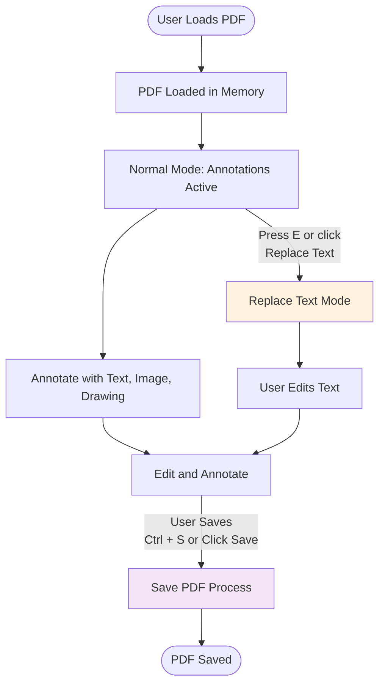

# Edit Mode Documentation

> **⚠️ IMPORTANT MAINTENANCE NOTE**
> This document describes how the edit mode (Replace Text mode) works in the Free PDF Editor.
> **If you make ANY changes to the edit mode functionality, you MUST update this document accordingly.**
> This includes changes to:
>
> - Text extraction algorithms
> - Line grouping logic
> - Edit mode state management
> - Save/export pipeline for edited text
> - UI components (EditableTextLayer, EditableTextBlock)
> - Width measurement strategies

---

## Table of Contents

1. [Overview](#overview)
2. [High-Level Workflow](#high-level-workflow)
3. [Text Extraction Algorithm](#text-extraction-algorithm)
4. [Detailed Component Flow](#detailed-component-flow)
5. [Save/Export Pipeline](#saveexport-pipeline)
6. [Key Data Structures](#key-data-structures)

---

## Overview

Edit mode (also called "Replace Text mode") enables users to visually replace text in PDF files by:

1. Extracting text items from the PDF using pdf.js
2. Grouping text items into editable lines
3. Rendering an editable overlay layer with text blocks
4. Tracking user edits in memory
5. Saving by masking original text with white rectangles and drawing new text

**Core Philosophy**: 100% client-side, no backend, privacy-first. All processing happens in the browser.

---

## High-Level Workflow



---

## Text Extraction Algorithm

The text extraction uses a **2-stage X-first algorithm** (`groupTextIntoLines`) that prevents column merging:

- **Stage 1**: Sort by X position → merge horizontally adjacent items into lines
- **Stage 2**: Group lines by X into columns → cluster by Y into paragraphs

**Why X-first?** The previous gap-based column detection was affected by the width safety buffer. X-position grouping is more robust and immune to width measurement variations.

### Algorithm Constants (Configurable)

**File**: [src/libs/textReplace/textExtractor.js:8](../src/libs/textReplace/textExtractor.js#L8)

```javascript
const LINE_CLUSTER_THRESHOLD = 1.5;          // ×fontSize for Y-clustering within columns (Stage 2)
const VERTICAL_THRESHOLD_MULTIPLIER = 0.6;   // ×fontSize for vertical alignment (Stage 1)
const HORIZONTAL_THRESHOLD_MULTIPLIER = 1.8; // ×fontSize for horizontal adjacency (Stage 1)
const X_COLUMN_TOLERANCE = 25;               // pixels, for grouping lines into columns (Stage 2)
```

**Tuning Guidelines**:

- ↑ `VERTICAL_THRESHOLD_MULTIPLIER` → More forgiving vertical alignment (reduces incorrect line splits in Stage 1)
- ↑ `HORIZONTAL_THRESHOLD_MULTIPLIER` → Allow wider gaps within lines (better for justified text in Stage 1)
- ↑ `X_COLUMN_TOLERANCE` → More forgiving column grouping (handles slight indentation variations in Stage 2)
- ↑ `LINE_CLUSTER_THRESHOLD` → Group lines with larger Y-distance into same paragraph (Stage 2)

---

## Detailed Component Flow

### 1. Entry Point: App.svelte

**File**: [src/App.svelte:33](../src/App.svelte#L33)

#### State Management

```javascript
// Core PDF state
let pdfFile = $state();
let pages = $state([]);
let allObjects = $state([]);

// Edit mode state
let editMode = $state(false);
let extractedTextByPage = $state([]);        // Array of text line arrays per page
let editedTextByPage = $state([]);           // Array of Maps (blockId → edit data)
let textExtractionInProgress = $state(false);
let selectedTextBlock = $state(null);        // Currently selected text block
let editableLayers = $state([]);             // Refs to EditableTextLayer components
```

**What it does**:

Manages the core state for edit mode functionality, including the edit mode toggle, extracted text data per page, user edits tracked as Maps, currently selected block, and component references for programmatic control.

---

#### Toggle Edit Mode

**Function**: [src/App.svelte:111](../src/App.svelte#L111) - `toggleEditMode()`

```javascript
async function toggleEditMode() {
  if (!editMode) {
    await enterEditMode();
  } else {
    exitEditMode();
  }
}
```

**What it does**:

Entry point that switches between normal annotation mode and Replace Text mode by calling `enterEditMode()` or `exitEditMode()`.

---

**Function**: [src/App.svelte:119](../src/App.svelte#L119) - `enterEditMode()`

```javascript
async function enterEditMode() {
  if (textExtractionInProgress) return;
  textExtractionInProgress = true;

  try {
    // Extract text from all pages
    const extracted = await Promise.all(
      pages.map(async (page) => {
        const items = await extractTextFromPage(page);  // Get text items
        return groupTextIntoLines(items);               // Group into lines
      })
    );
    extractedTextByPage = extracted;
    editedTextByPage = pages.map(() => new Map());
    editMode = true;
    showNoticeModal = true;
  } catch (e) {
    console.error('Failed to extract text:', e);
    showToast('Failed to extract text from PDF', 'error');
  } finally {
    textExtractionInProgress = false;
  }
}
```

**What it does**:

Extracts text from all PDF pages in parallel, applies the X-first two-stage grouping algorithm to organize text into editable lines, initializes empty edit tracking Maps for each page, and activates edit mode to render the editable overlay.

---

**Function**: [src/App.svelte:143](../src/App.svelte#L143) - `exitEditMode()`

```javascript
function exitEditMode() {
  editMode = false;
  debugOverlay = false;
  selectedTextBlock = null;
  const editCount = editedTextByPage.reduce((sum, map) => sum + map.size, 0);
  if (editCount > 0) {
    showToast(`Replace text mode disabled. ${editCount} change(s) will be saved.`, 'info', 3000);
  }
}
```

**What it does**:

Disables edit mode while preserving all edits in memory for the save operation, counts total changes across pages, and displays a confirmation toast to the user.

---

#### Track Text Edits

**Function**: [src/App.svelte:156](../src/App.svelte#L156) - `updateEditedText()`

```javascript
function updateEditedText(pageIndex, detail) {
  const { id, ...editData } = detail;
  editedTextByPage[pageIndex].set(id, editData);
  editedTextByPage = [...editedTextByPage]; // Trigger reactivity
}
```

**What it does**:

Captures text block changes from the editable layer and stores them in the page-specific Map, then triggers Svelte reactivity to update the UI. Edit data includes new text, font settings, and bounding box.

---

#### Render EditableTextLayer

```svelte
{#if editMode && extractedTextByPage[pIndex]}
  <EditableTextLayer
    bind:this={editableLayers[pIndex]}
    textLines={extractedTextByPage[pIndex]}
    editedItems={editedTextByPage[pIndex]}
    showDebugOverlay={debugOverlay}
    pageScale={pagesScale[pIndex]}
    ontextchange={(detail) => updateEditedText(pIndex, detail)}
    onblockselect={(detail) => handleReplaceBlockSelect(pIndex, detail)}
  />
{/if}
```

**What it does**:

Conditionally renders the EditableTextLayer component when edit mode is active, passing text lines, edit tracking data, and callbacks while binding a reference for programmatic font/size updates.

---

### 2. Text Extraction: textExtractor.js

**File**: [src/libs/textReplace/textExtractor.js:19](../src/libs/textReplace/textExtractor.js#L19)

#### Extract Text Items

**Function**: `extractTextFromPage(pagePromise)`

```javascript
export async function extractTextFromPage(pagePromise) {
  const page = await pagePromise;
  const viewport = page.getViewport({ scale: 1, rotation: 0 });
  const textContent = await page.getTextContent();

  return textContent.items
    .filter((item) => item.str && item.str.trim())
    .map((item, index) => {
      const [scaleX, _skewX, skewY, scaleY, tx, ty] = item.transform;

      // Calculate font size from transform matrix
      const fontSize = Math.sqrt(scaleY * scaleY + skewY * skewY);

      // Check for rotation
      const rotation = Math.atan2(skewY, scaleX) * (180 / Math.PI);
      const isRotated = Math.abs(rotation) > 5;

      const height = item.height || fontSize * 1.2;

      // Convert PDF coords (bottom-left) to screen coords (top-left)
      const screenY = viewport.height - ty;

      return {
        id: `text-${index}`,
        text: item.str,
        x: tx,
        y: screenY - height,
        width: measureTextWidth(item.str, fontSize, item.fontName || 'Helvetica', item.width),
        height,
        fontSize,
        fontName: item.fontName || 'Helvetica',
        isRotated,
        rotation,
      };
    });
}
```

**What it does**:

Extracts raw text items from a PDF page using pdf.js, parses the transform matrix to calculate font size and rotation, converts PDF coordinates (bottom-left origin) to screen coordinates (top-left origin), and measures text width using the three-tier strategy. Filters out empty items but keeps rotated text metadata for later filtering.

**Key Insight**: The Y-coordinate transformation from PDF to screen coordinates is critical for correct positioning.

---

#### Stage 1: Y-Clustering

**Function**: [src/libs/textReplace/textExtractor.js:64](../src/libs/textReplace/textExtractor.js#L64) - `clusterByYPosition(items)`

```javascript
function clusterByYPosition(items) {
  const clusters = [];
  const sorted = [...items].sort((a, b) => a.y - b.y);

  for (const item of sorted) {
    const threshold = item.fontSize * VERTICAL_THRESHOLD_MULTIPLIER + 2;

    // Find existing cluster within threshold (using average Y)
    const cluster = clusters.find((c) => {
      const avgY = c.items.reduce((sum, i) => sum + i.y, 0) / c.items.length;
      return Math.abs(item.y - avgY) < threshold;
    });

    if (cluster) {
      cluster.items.push(item);
    } else {
      clusters.push({ items: [item] });
    }
  }

  return clusters;
}
```

**What it does**:

Groups text items that are vertically close together by sorting items top-to-bottom, then iteratively assigning each item to an existing cluster (if within threshold) or creating a new cluster. Uses the cluster's average Y position for comparison to prevent drift from slight vertical variations.

**Why Average Y?**: Prevents cluster drift when items have minor baseline differences, making grouping more stable than using the first item's Y.

---

#### Stage 2: Column Detection

**Function**: [src/libs/textReplace/textExtractor.js:94](../src/libs/textReplace/textExtractor.js#L94) - `detectColumns(items)`

```javascript
function detectColumns(items) {
  if (items.length <= 1) return [items];

  const sorted = [...items].sort((a, b) => a.x - b.x);

  // Analyze gaps between consecutive items
  const gaps = [];
  for (let i = 0; i < sorted.length - 1; i++) {
    const gap = sorted[i + 1].x - (sorted[i].x + sorted[i].width);
    const fontSize = sorted[i].fontSize;
    gaps.push({ index: i, gap, fontSize });
  }

  // Find "column gaps" - significantly larger than word spacing
  const columnGaps = gaps.filter(
    (g) => g.gap > g.fontSize * COLUMN_GAP_MULTIPLIER && g.gap > COLUMN_GAP_MIN_PX
  );

  if (columnGaps.length === 0) {
    return [sorted];
  }

  // Split into columns at detected gaps
  const columns = [];
  let columnStart = 0;

  for (const gap of columnGaps) {
    columns.push(sorted.slice(columnStart, gap.index + 1));
    columnStart = gap.index + 1;
  }
  columns.push(sorted.slice(columnStart));

  return columns;
}
```

**What it does**:

Analyzes horizontal gaps between consecutive items (sorted left-to-right) to identify column boundaries using dual criteria: gaps must exceed both a relative threshold (3× font size) and an absolute minimum (50px). Splits items into separate columns at detected boundaries or returns a single column if no significant gaps exist.

**Why Two Thresholds?**: Dual criteria prevent false positives from wide spacing in large fonts and false negatives from narrow columns in small fonts.

---

#### Stage 3: Line Merging

**Function**: [src/libs/textReplace/textExtractor.js:137](../src/libs/textReplace/textExtractor.js#L137) - `mergeItemsInColumn(items)`

```javascript
function mergeItemsInColumn(items) {
  const lines = [];
  let currentLine = null;

  for (const item of items) {
    if (!currentLine) {
      currentLine = createLineFromItem(item);
    } else if (shouldMergeIntoLine(currentLine, item)) {
      mergeItemIntoLine(currentLine, item);
    } else {
      lines.push(currentLine);
      currentLine = createLineFromItem(item);
    }
  }

  if (currentLine) {
    lines.push(currentLine);
  }

  return lines;
}
```

**What it does**:

Iterates through items in a single column, merging consecutive items into lines when they pass both vertical alignment and horizontal adjacency checks. Non-mergeable items start new lines.

---

**Function**: [src/libs/textReplace/textExtractor.js:214](../src/libs/textReplace/textExtractor.js#L214) - `shouldMergeIntoLine(line, item)`

```javascript
function shouldMergeIntoLine(line, item) {
  const fontSize = Math.max(line.fontSize, item.fontSize);
  const verticalThreshold = fontSize * VERTICAL_THRESHOLD_MULTIPLIER;

  // Check if vertically aligned (same line)
  const verticallyAligned = Math.abs(item.y - line.y) < verticalThreshold;

  // Check if horizontally adjacent (not too far apart)
  const lineRight = line.x + line.width;
  const gap = item.x - lineRight;
  const maxGap = fontSize * HORIZONTAL_THRESHOLD_MULTIPLIER;
  const horizontallyAdjacent = gap >= -5 && gap < maxGap;

  return verticallyAligned && horizontallyAdjacent;
}
```

**What it does**:

Determines if an item should merge into the current line by checking two conditions: vertical alignment (Y difference < 0.6× font size) and horizontal adjacency (gap between -5px and 1.8× font size). Both must be true to merge.

---

**Function**: [src/libs/textReplace/textExtractor.js:234](../src/libs/textReplace/textExtractor.js#L234) - `mergeItemIntoLine(line, item)`

```javascript
function mergeItemIntoLine(line, item) {
  line.items.push(item);

  // Add space between items if there's a gap
  const lineRight = line.x + line.width;
  const gap = item.x - lineRight;
  if (gap > line.fontSize * 0.3) {
    line.text += ' ';
  }
  line.text += item.text;

  // Update bounding box
  const newRight = Math.max(lineRight, item.x + item.width);
  line.width = newRight - line.x;
  line.height = Math.max(line.height, item.height);

  // Use the most common font size
  if (item.fontSize > line.fontSize) {
    line.fontSize = item.fontSize;
  }
}
```

**What it does**:

Merges an item into the current line by appending it to the items array, adding space if gap exceeds 30% of font size, concatenating text, expanding the bounding box to include the new item, and updating to the larger font size.

---

#### Orchestrate Three Stages

**Function**: [src/libs/textReplace/textExtractor.js:165](../src/libs/textReplace/textExtractor.js#L165) - `groupTextIntoLines(items)`

```javascript
export function groupTextIntoLines(items) {
  if (!items.length) return [];

  // Filter out rotated text for MVP
  const editableItems = items.filter((item) => !item.isRotated);

  if (!editableItems.length) return [];

  // Stage 1: Cluster items by Y-position
  const clusters = clusterByYPosition(editableItems);

  // Stage 2 & 3: For each cluster, detect columns and merge into lines
  const allLines = [];

  for (const cluster of clusters) {
    // Stage 2: Detect columns within this Y-cluster
    const columns = detectColumns(cluster.items);

    // Stage 3: Merge items within each column into lines
    for (const column of columns) {
      const columnLines = mergeItemsInColumn(column);
      allLines.push(...columnLines);
    }
  }

  return allLines;
}
```

**What it does**:

Orchestrates the X-first two-stage algorithm by first filtering out rotated text, then sorting by X position and merging horizontally adjacent items into lines (Stage 1), and finally grouping lines by X into columns and clustering by Y into paragraphs (Stage 2). Returns all processed lines.

---

### 3. Width Measurement: widthMeasurement.js

**File**: [src/libs/textReplace/widthMeasurement.js:26](../src/libs/textReplace/widthMeasurement.js#L26)

#### Three-Tier Width Strategy

**Function**: `measureTextWidth(text, fontSize, fontName, pdfJsWidth)`

```javascript
export function measureTextWidth(text, fontSize, fontName, pdfJsWidth = null) {
  // Tier 1: Use pdf.js width if available (most accurate)
  if (pdfJsWidth !== null && pdfJsWidth > 0) {
    // Add fixed pixel buffer even for pdf.js width to account for:
    // - Font substitution (original font → mapped font)
    // - Rendering differences (PDF → browser)
    // - Kerning variations between font implementations
    return pdfJsWidth + SAFETY_BUFFER_PX;
  }

  // Check cache
  const cacheKey = `${text}|${fontSize}|${fontName}`;
  if (widthCache.has(cacheKey)) {
    return widthCache.get(cacheKey);
  }

  let width;

  // Tier 2: Canvas measurement (accurate, font-specific)
  try {
    width = measureWithCanvas(text, fontSize, fontName);
  } catch (e) {
    console.warn('Canvas measurement failed, falling back to estimation:', e);
    // Tier 3: Enhanced character-based estimation (fallback)
    width = estimateWithCharacters(text, fontSize, fontName);
  }

  // Cache result (with size limit)
  if (widthCache.size >= MAX_CACHE_SIZE) {
    // Simple FIFO eviction
    const firstKey = widthCache.keys().next().value;
    widthCache.delete(firstKey);
  }
  widthCache.set(cacheKey, width);

  return width;
}
```

**What it does**:

Implements a three-tier fallback strategy for measuring text width: first using pdf.js width with 3% buffer (accounts for font substitution), then Canvas measureText API if pdf.js width unavailable, and finally character-based estimation if canvas fails. Results are cached with FIFO eviction at 1000 entries.

**Why Three Tiers?**: Graceful degradation ensures width measurement always succeeds regardless of available data sources.

**Why Padding on pdf.js Width?**: Font substitution (e.g., ArialMT → Helvetica) means replacement text may be wider than original, so the 3% buffer ensures full coverage.

---

**Function**: [src/libs/textReplace/widthMeasurement.js:67](../src/libs/textReplace/widthMeasurement.js#L67) - `measureWithCanvas(text, fontSize, fontName)`

```javascript
function measureWithCanvas(text, fontSize, fontName) {
  if (!canvasContext) {
    const canvas = document.createElement('canvas');
    canvasContext = canvas.getContext('2d');
  }

  // Map PDF font to available font
  const mappedFont = mapToAvailableFont(fontName);
  canvasContext.font = `${fontSize}px "${mappedFont}", sans-serif`;

  const metrics = canvasContext.measureText(text);

  // Add 3% safety buffer for slight variations
  return metrics.width * 1.03;
}
```

**What it does**:

Measures text width using a lazily-initialized canvas element and the browser's native measureText API with the mapped font, adding a 3% safety buffer for rendering variations, kerning differences, and subpixel positioning between canvas and PDF rendering.

---

**Function**: [src/libs/textReplace/widthMeasurement.js:87](../src/libs/textReplace/widthMeasurement.js#L87) - `estimateWithCharacters(text, fontSize, fontName)`

```javascript
function estimateWithCharacters(text, fontSize, fontName) {
  const avgWidths = {
    monospace: 0.6,
    sansSerif: 0.52,
    serif: 0.55,
    default: 0.55,
  };

  const category = getFontCategory(fontName);
  const baseWidth = avgWidths[category];

  // Adjust for character-specific widths
  let totalWidth = 0;
  for (const char of text) {
    if (/[WMwm@%]/.test(char)) totalWidth += 1.3;        // Wide chars
    else if (/[iIlj1!|.',:;]/.test(char)) totalWidth += 0.4;  // Narrow chars
    else if (/[frt]/.test(char)) totalWidth += 0.6;     // Medium-narrow chars
    else totalWidth += 1.0;                              // Default chars
  }

  return totalWidth * baseWidth * fontSize * 1.05; // 5% safety buffer
}
```

**What it does**:

Estimates text width using character-specific multipliers (wide, narrow, normal) combined with font category base widths (monospace, sans-serif, serif), adding a 5% safety buffer. Higher buffer than canvas measurement due to lack of actual kerning and font-specific glyph metrics.

---

### 4. Editable Layer: EditableTextLayer.svelte

**File**: [src/libs/textReplace/EditableTextLayer.svelte:72](../src/libs/textReplace/EditableTextLayer.svelte#L72)

#### White Masking

```svelte
<div class="absolute inset-0 pointer-events-none" aria-hidden="true">
  {#each textLines as line (line.id)}
    {@const padding = getMaskPadding(line.fontSize)}
    <div
      class="absolute bg-white"
      style="
        left: {line.x - padding}px;
        top: {line.y - padding}px;
        width: {line.width + padding * 2}px;
        height: {line.height + padding * 2}px;
      "
    ></div>
  {/each}
</div>
```

**What it does**:

Creates a non-interactive layer that renders white rectangular masks over each text line's original position, using dynamic padding (15% of font size, minimum 3px) to ensure complete coverage of underlying PDF glyphs.

---

**Function**: [src/libs/textReplace/EditableTextLayer.svelte:54](../src/libs/textReplace/EditableTextLayer.svelte#L54) - `getMaskPadding(fontSize)`

```javascript
function getMaskPadding(fontSize) {
  return Math.max(3, Math.ceil(fontSize * 0.15));
}
```

**What it does**:

Calculates dynamic padding (15% of font size, minimum 3px) that scales with text size to ensure white masks fully cover original glyphs regardless of font size.

---

#### Render Text Blocks

```svelte
{#each textLines as line (line.id)}
  <EditableTextBlock
    bind:this={blockRefs[line.id]}
    block={line}
    {pageScale}
    isEdited={isBlockEdited(line.id)}
    onselect={handleBlockSelect}
    onchange={handleBlockChange}
  />
{/each}
```

**What it does**:

Renders an EditableTextBlock component for each text line, binding component references for programmatic updates and passing block data, scale, edit status, and change/select callbacks.

---

### 5. Editable Block: EditableTextBlock.svelte

**File**: [src/libs/textReplace/EditableTextBlock.svelte:8](../src/libs/textReplace/EditableTextBlock.svelte#L8)

#### Block Props

```javascript
let { block, isEdited = false, pageScale = 1, onselect, onchange } = $props();
```

**What it does**:

Defines component props including the text block data, page scale for zoom handling, edit status flag, and callbacks for selection and change events.

---

#### State Management

```javascript
let isSelected = $state(false);
let isEditing = $state(false);
let editableEl = $state();
let currentText = $state(block.text);
let selectedFont = $state(mapToAvailableFont(block.fontName));
let selectedFontSize = $state(block.fontSize);
let fontSizeAuto = $state(true); // Track if using auto-detected size

// Drag/pan state
let offsetX = $state(0);
let offsetY = $state(0);
let panDX = $state(0);
let panDY = $state(0);
let isDragging = $state(false);

// Resize state
let widthDelta = $state(0);
let heightDelta = $state(0);
let isResizing = $state(false);

// Computed dimensions
let currentWidth = $derived(block.width + widthDelta);
let currentHeight = $derived(block.height + heightDelta);

// Derived: estimated text width for clipping warning (uses widthMeasurement.js)
let estimatedTextWidth = $derived(measureTextWidth(currentText, selectedFontSize, selectedFont));
let mayBeClipped = $derived(estimatedTextWidth > currentWidth * 1.1);
```

**What it does**:

Manages component state including selection/editing status, font settings, drag/pan offsets for repositioning, resize deltas for dimension adjustment, derived current dimensions, and accurate clipping detection using `measureTextWidth()` instead of simple character-count estimation.

---

#### Selection Handler

```javascript
function handleClick(e) {
  e.stopPropagation();
  if (!isSelected) {
    isSelected = true;
    isEditing = false;
    onselect?.({
      id: block.id,
      text: currentText,
      fontSize: selectedFontSize,
      fontName: selectedFont,
      bounds: { ...bounds },
    });
  }
}
```

**What it does**:

Handles single-click events by stopping propagation, marking the block as selected, and notifying the parent component with current block state for sidebar synchronization.

---

#### Double-Click to Edit

```javascript
function handleDoubleClick(e) {
  e.stopPropagation();
  if (!isEditing) {
    isEditing = true;
    tick().then(() => {
      contentEditableDiv?.focus();
      // Select all text
      const selection = window.getSelection();
      const range = document.createRange();
      range.selectNodeContents(contentEditableDiv);
      selection.removeAllRanges();
      selection.addRange(range);
    });
  }
}
```

**What it does**:

Activates editing mode on double-click, waits for DOM update, focuses the contenteditable element, and selects all text for easy replacement.

---

#### Text Change Handler

```javascript
function handleInput(e) {
  const newText = e.target.textContent || '';

  // Prevent empty text
  if (newText.trim() === '') {
    e.target.textContent = currentText;
    return;
  }

  currentText = newText;
  notifyChange();
}

function notifyChange() {
  onchange?.({
    id: block.id,
    newText: currentText,
    fontSize: selectedFontSize,
    fontName: selectedFont,
    bounds: { ...bounds },
  });
}
```

**What it does**:

Captures text input changes, prevents empty text that would make blocks invisible, updates the current text state, and notifies the parent with complete edit data including text, font, size, and bounds.

---

#### Clipping Warning

```svelte
{#if mayBeClipped && (isEdited || isSelected)}
  <span
    class="absolute -bottom-2 -right-2 bg-orange-500 text-white text-xs px-1 rounded cursor-help"
    style="font-size: 10px;"
    title="Text may be clipped in exported PDF"
  >
    ⚠️
  </span>
{/if}
```

**What it does**:

Compares measured text width (using `measureTextWidth()` for accuracy) against the current bounding box width, displaying a warning icon if text might be clipped in the exported PDF. Only visible when block is edited or selected to minimize clutter.

---

### 6. PDFPage Component: PDFPage.svelte

**File**: [src/components/PDFPage.svelte:14](../src/components/PDFPage.svelte#L14)

#### Render PDF Page

```javascript
async function render() {
  const _page = await page;
  const viewport = _page.getViewport({ scale: 1, rotation: 0 });
  width = viewport.width;
  height = viewport.height;
  // Wait for Svelte to update canvas dimensions
  await new Promise((resolve) => setTimeout(resolve, 0));
  const context = canvas.getContext('2d');
  await _page.render({
    canvasContext: context,
    viewport,
  }).promise;
  measure();
  window.addEventListener('resize', measure);
}
```

**What it does**:

Renders a PDF page to canvas by getting the viewport at original scale, waiting for DOM updates, then using pdf.js to render. Calculates responsive scaling and listens for window resize events.

---

## Save/Export Pipeline

When the user saves the PDF, the edited text is applied by:

1. Drawing white rectangles over original text locations
2. Embedding new text using pdf-lib and makeTextPDF

**File**: [src/utils/PDF.js:5](../src/utils/PDF.js#L5)

---

### Save Entry Point

**Function**: `save(pdfFile, objects, editedTextByPage, name, onProgress)`

```javascript
export async function save(pdfFile, objects, editedTextByPage = [], name, onProgress = () => {}) {
  onProgress(5);
  const PDFLib = await getAsset('PDFLib');
  const download = await getAsset('download');
  const makeTextPDF = await getAsset('makeTextPDF');
  onProgress(15);

  let pdfDoc;
  try {
    pdfDoc = await PDFLib.PDFDocument.load(await readAsArrayBuffer(pdfFile));
  } catch (e) {
    console.log('Failed to load PDF.');
    throw e;
  }

  onProgress(25);
  const pages = pdfDoc.getPages();
  const totalPages = pages.length;
  let processedPages = 0;

  const pagesProcesses = pages.map(async (page, pageIndex) => {
    const pageObjects = objects[pageIndex];
    const editedText = editedTextByPage[pageIndex] || new Map();
    const pageHeight = page.getHeight();

    // Process edited text first (cover original with white, draw new text)
    if (editedText.size > 0) {
      await processEditedText(page, pdfDoc, editedText, pageHeight, PDFLib, makeTextPDF);
    }

    // ... process annotations (images, text fields, drawings)

    processedPages++;
    onProgress(25 + Math.round((processedPages / totalPages) * 50));
  });

  await Promise.all(pagesProcesses);
  onProgress(80);

  try {
    const pdfBytes = await pdfDoc.save();
    onProgress(95);
    download(pdfBytes, name, 'application/pdf');
    onProgress(100);
  } catch (e) {
    console.log('Failed to save PDF.');
    throw e;
  }
}
```

**What it does**:

Loads vendored libraries (PDFLib, download, makeTextPDF), loads the original PDF, processes each page to apply text edits and annotations, then saves and downloads the modified PDF with progress tracking.

---

### Process Edited Text

**Function**: [src/utils/PDF.js:118](../src/utils/PDF.js#L118) - `processEditedText(page, pdfDoc, editedText, pageHeight, PDFLib, makeTextPDF)`

```javascript
async function processEditedText(page, pdfDoc, editedText, pageHeight, PDFLib, makeTextPDF) {
  const { rgb } = PDFLib;

  for (const [_itemId, edit] of editedText) {
    const { bounds, newText, fontSize, fontName } = edit;

    if (!bounds) continue;

    // 1. Draw white rectangle to cover original text
    const padding = 2;
    page.drawRectangle({
      x: bounds.x - padding,
      y: pageHeight - bounds.y - bounds.height - padding,
      width: bounds.width + padding * 2,
      height: bounds.height + padding * 2,
      color: rgb(1, 1, 1), // White
      borderWidth: 0,
    });

    // 2. Draw new text on top (if not empty)
    if (newText && newText.trim()) {
      try {
        const font = await fetchFont(fontName || 'Helvetica');
        const textFontSize = fontSize || 12;
        const lineHeight = 1.2;
        const lines = [newText];
        const textHeight = textFontSize * lineHeight;
        const textWidth = bounds.width + 20; // Add extra width

        const [textPage] = await pdfDoc.embedPdf(
          await makeTextPDF({
            lines,
            fontSize: textFontSize,
            lineHeight,
            width: textWidth,
            height: textHeight,
            font: font.buffer || fontName || 'Helvetica',
            dy: font.correction(textFontSize, lineHeight),
          })
        );

        page.drawPage(textPage, {
          x: bounds.x,
          y: pageHeight - bounds.y - bounds.height,
          width: textWidth,
          height: textHeight,
        });
      } catch (e) {
        console.error('Failed to draw edited text:', e);
      }
    }
  }
}
```

**What it does**:

Applies text edits to PDF pages by first drawing white rectangles over original text (with 2px padding and coordinate transformation from screen to PDF coordinates), then creating temporary PDFs with new text using makeTextPDF and embedding them at the original locations.

**Critical Coordinate Transform**: Converts from screen coordinates (Y from top) to PDF coordinates (Y from bottom) using `pageHeight - y - height`.

---

## Key Data Structures

### 1. Text Item (from pdf.js)

```javascript
{
  id: "text-0",
  text: "Hello World",
  x: 100,           // X position (screen coords, top-left origin)
  y: 200,           // Y position (screen coords, top-left origin)
  width: 85.4,      // Measured text width (pixels)
  height: 14.2,     // Text height (pixels)
  fontSize: 12,     // Font size (pixels)
  fontName: "Helvetica",
  isRotated: false, // True if rotated >5°
  rotation: 0.5     // Rotation angle (degrees)
}
```

---

### 2. Text Line (grouped items)

```javascript
{
  id: "text-0",          // ID from first item
  items: [item1, item2], // Original items in this line
  text: "Hello World",   // Merged text
  x: 100,                // Left edge (screen coords)
  y: 200,                // Top edge (screen coords)
  width: 85.4,           // Total width (expanded to include all items)
  height: 14.2,          // Max height of items
  fontSize: 12,          // Max font size of items
  fontName: "Helvetica"  // Font name from first item
}
```

---

### 3. Edit Data (tracked changes)

```javascript
{
  id: "text-0",           // Text line ID
  newText: "Hi there",    // User's edited text
  fontSize: 12,           // Current font size (may be changed)
  fontName: "Helvetica",  // Current font name (may be changed)
  bounds: {               // Bounding box (may be resized)
    x: 100,
    y: 200,
    width: 85.4,
    height: 14.2
  }
}
```

**Storage**: `editedTextByPage[pageIndex].set(lineId, editData)`

---

### 4. State in App.svelte

```javascript
// Extracted text lines per page
extractedTextByPage: [
  [line1, line2, ...],  // Page 0 lines
  [line1, line2, ...],  // Page 1 lines
  ...
]

// Edited text tracking per page
editedTextByPage: [
  Map { "text-0" => editData, "text-5" => editData },  // Page 0 edits
  Map { "text-2" => editData },                        // Page 1 edits
  ...
]

// Currently selected text block
selectedTextBlock: {
  pageIndex: 0,
  id: "text-0",
  text: "Hello World",
  fontSize: 12,
  fontName: "Helvetica",
  bounds: { x, y, width, height }
}
```

---

## Performance Characteristics

| Operation                    | Target | Actual (Typical) | Notes                             |
| ---------------------------- | ------ | ---------------- | --------------------------------- |
| Text extraction per page     | <50ms  | ~15-30ms         | Depends on text density           |
| Line grouping per page       | <50ms  | ~5-15ms          | Two-stage X-first algorithm       |
| Width measurement (cached)   | <1ms   | <0.1ms           | Map lookup                        |
| Width measurement (uncached) | <5ms   | ~1-3ms           | Canvas measureText                |
| Total overhead per page      | <100ms | ~20-50ms         | Extraction + grouping + rendering |
| Cache hit rate               | >80%   | ~85-90%          | After first few pages             |
| Cache memory usage           | <100KB | ~50KB            | 1000 entries                      |

---

## Common Issues & Solutions

### Issue: White masks too small (original text visible)

**Cause**: Width measurement underestimating text width

**Solution**: Increase padding in `widthMeasurement.js`:

- Canvas: Line 73 - Increase multiplier or add more absolute padding
- Estimation: Line 101 - Increase multiplier or add more absolute padding

---

### Issue: Columns merging together

**Cause**: Column gap detection threshold too low

**Solution**: Increase thresholds in `textExtractor.js`:

- Line 11: Increase `COLUMN_GAP_MULTIPLIER` (default 3.0 → 3.5)
- Line 12: Increase `COLUMN_GAP_MIN_PX` (default 50 → 75)

---

### Issue: Lines incorrectly split

**Cause**: Horizontal threshold too strict

**Solution**: Increase threshold in `textExtractor.js`:

- Line 10: Increase `HORIZONTAL_THRESHOLD_MULTIPLIER` (default 1.8 → 2.0)

---

### Issue: Different baselines merging

**Cause**: Vertical threshold too forgiving

**Solution**: Decrease threshold in `textExtractor.js`:

- Line 9: Decrease `VERTICAL_THRESHOLD_MULTIPLIER` (default 0.6 → 0.5)

---

### Issue: Saved PDF has misaligned text

**Cause**: Coordinate transformation error

**Check**:

- `textExtractor.js` line 41: Screen Y conversion correct?
- `PDF.js` line 131, 161: PDF Y conversion correct?
- Remember: PDF uses bottom-left origin, DOM uses top-left

---

## Testing Checklist

Before deploying changes to edit mode, verify:

- [ ] **Text Extraction**
  - [ ] Single-column documents group correctly
  - [ ] Multi-column documents don't merge columns
  - [ ] Tables: rows not merged across columns
  - [ ] Mixed font sizes handled
  - [ ] Justified text (wide spacing) handled
  - [ ] Common fonts (Helvetica, Times, Courier)

- [ ] **Text Editing**
  - [ ] White masks fully cover original text
  - [ ] Clipping warnings accurate (no false positives)
  - [ ] Font changes propagate to save
  - [ ] Size changes propagate to save
  - [ ] Drag/resize works
  - [ ] Double-click to edit
  - [ ] Click away to deselect

- [ ] **Performance**
  - [ ] 10-page document extracts in <500ms total
  - [ ] No visible lag during typing
  - [ ] Cache hit rate >80% (check `getCacheStats()`)

- [ ] **Save/Export**
  - [ ] Edited text appears in saved PDF
  - [ ] Original text fully masked
  - [ ] Text position matches visual editor
  - [ ] Multi-page PDFs save correctly
  - [ ] No console errors during save

---

## Debug Tools

### Enable Debug Overlay

Press `D` key while in edit mode or set in code:

```javascript
// src/App.svelte line 54
let debugOverlay = $state(true);
```

Shows:

- Red borders around detected text blocks
- Block index, dimensions, font size

---

### Check Width Cache Stats

In browser console:

```javascript
import { getCacheStats } from './libs/textReplace/widthMeasurement.js';
getCacheStats(); // { size: 850, maxSize: 1000 }
```

---

### Profile Text Extraction

Wrap extraction in timing:

```javascript
// src/App.svelte line 125
console.time('text-extraction');
const extracted = await Promise.all(
  pages.map(async (page) => {
    const items = await extractTextFromPage(page);
    return groupTextIntoLines(items);
  })
);
console.timeEnd('text-extraction'); // ~100-200ms for 10 pages
```

---

## Future Enhancements

Potential improvements documented in `AGENT.md`:

- [ ] Rotated text support (currently filtered)
- [ ] Bold/italic preservation (currently lost)
- [ ] Multi-line text blocks (currently single-line)
- [ ] RTL (right-to-left) text support
- [ ] Alignment controls (left/center/right/justify)
- [ ] Batch font replacement
- [ ] Undo/redo for text edits
- [ ] Text search and replace
- [ ] Better preview mode

---

## References

- **Main Documentation**: [AGENT.md](AGENT.md)
- **Claude Instructions**: [.claude/CLAUDE.md](.claude/CLAUDE.md)

---

*Last Updated: 2026-02-06*
*Version: 1.0*
*Author: Auto-generated from codebase analysis*
